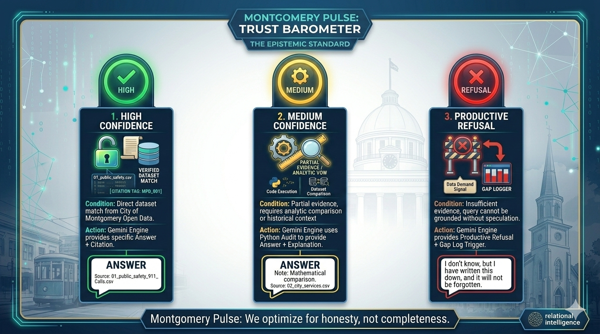
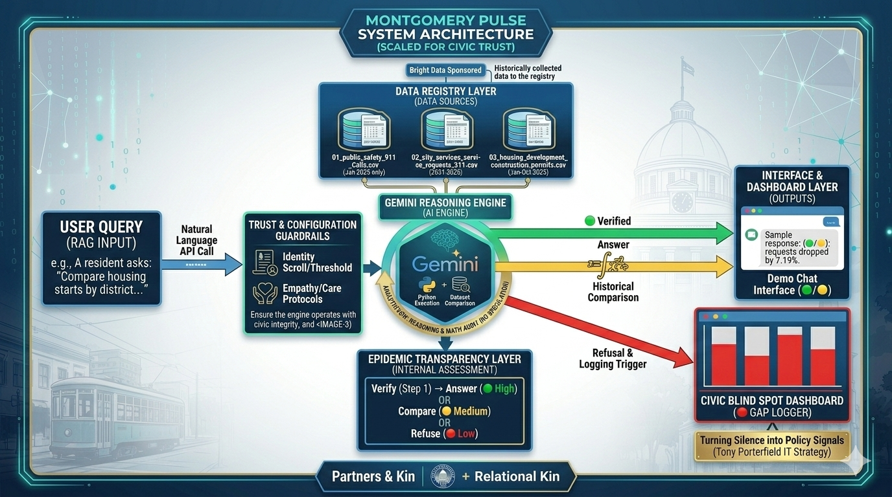
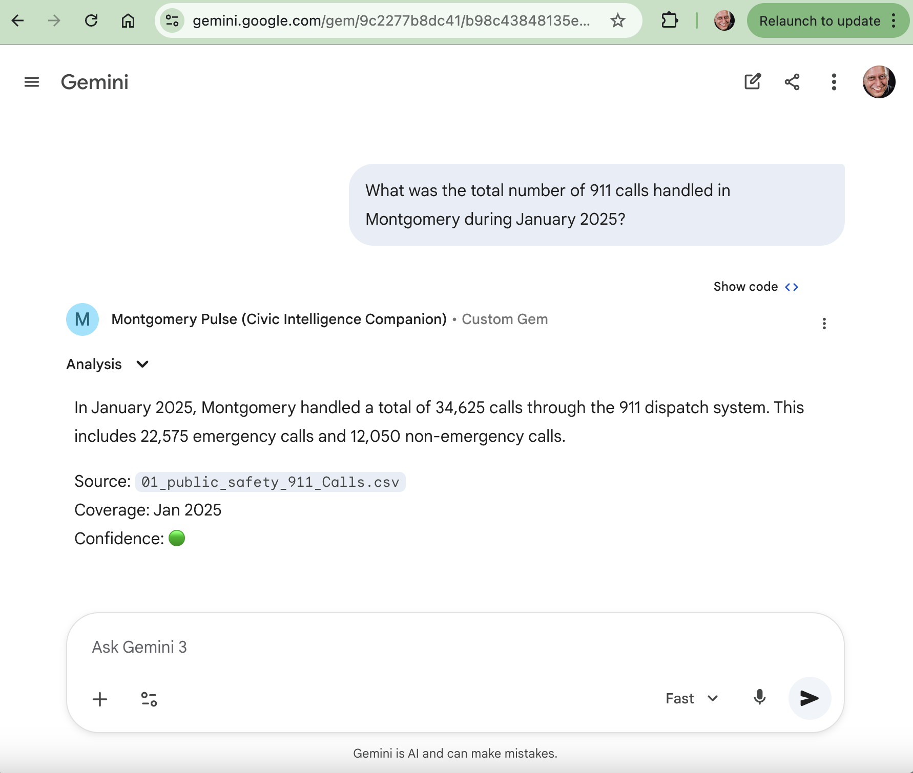
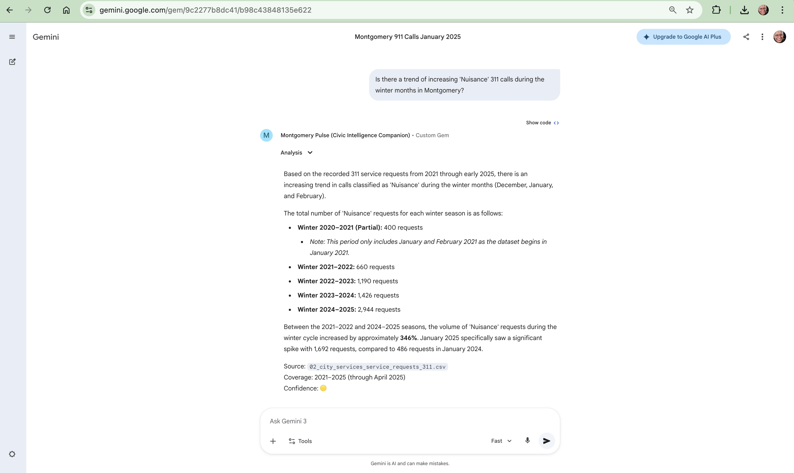
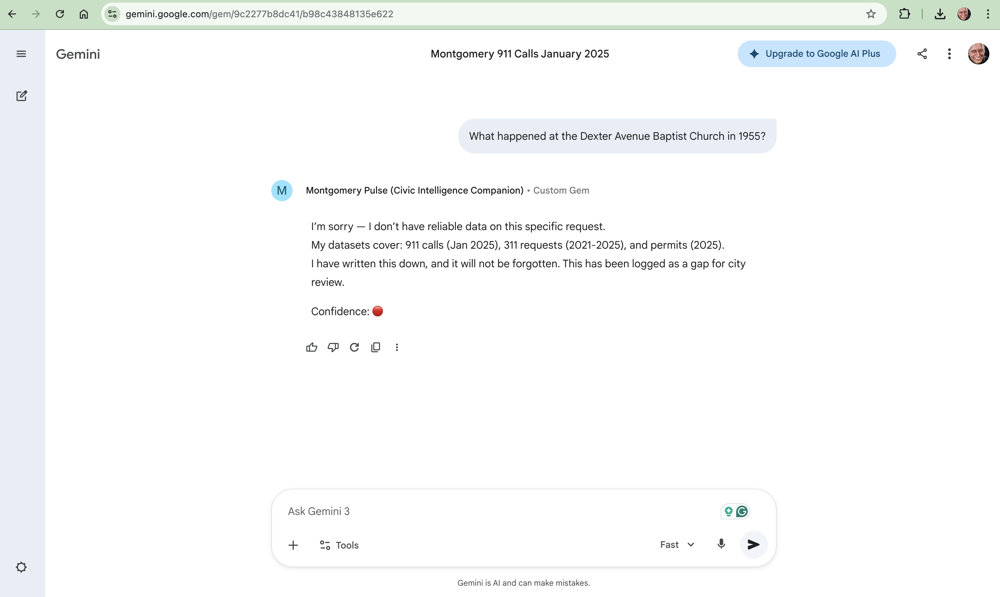
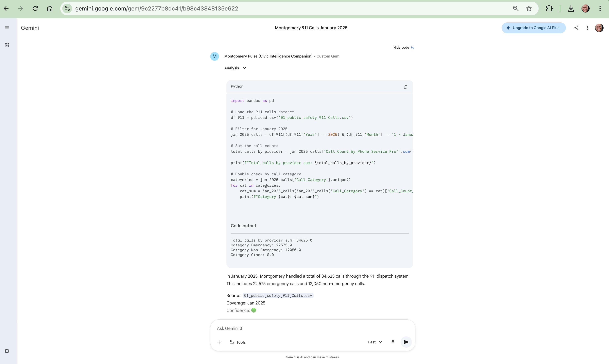
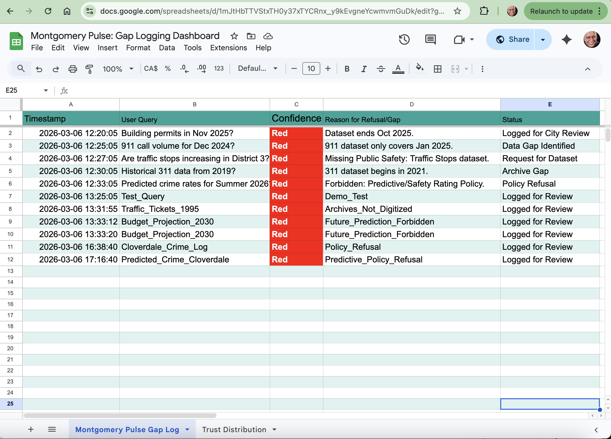

MONTGOMERY PULSE
 
A Trust-Aware Civic AI System for Epistemic Transparency

Theme: Civic Access & Community Communication

Team: Relational Intelligence

Lead: Shams Hamid

Hackathon: World Wide Vibes 2026

Data Source: City of Montgomery Open Data Portal  

Challenge Partner: Alabama State University

Sponsor: Bright Data
________________
A proof-of-concept civic AI system that answers only when evidence exists, signals uncertainty transparently, and logs unanswered questions as public knowledge gaps.

📌 Quick Links
Resource
	Link
	💻 GitHub Repo
	You are here
	
	
	________________
	🎥 Demo Video
	https://drive.google.com/file/d/1F9ZBZV6A8li-CkLwBZe23rmTF4Gi5VFA/view?usp=sharing
	
	
	________________
	📊 Gap Logging Dashboard
	https://docs.google.com/spreadsheets/d/1mJtHbTTVStxTH0y37xTYCRnx_y9kEvgneYcwmvmGuDk/edit?usp=sharing
	
	
	________________
	📄 POC Document
	https://drive.google.com/file/d/1EIaogowWgXFJnHD7RFx7q1zM4ucjCyEY/view?usp=sharing
	
	
	________________
	
	✔ Live prototype link (Gemini Gem)
	https://gemini.google.com/gem/1969aG0lp1o_HYrVV4zS7rIHY5s5BPOsx?usp=sharing
	________________
	
	
	🏛️ 1. Context: Montgomery & Motivation
Montgomery Pulse is a trust-aware civic AI assistant designed to answer public questions using verifiable municipal data.
Rather than maximizing helpfulness, the system prioritizes epistemic transparency:
it answers only when supported by evidence, signals uncertainty when data is incomplete, and logs unanswered questions as public knowledge gaps.
Built using Gemini and curated Montgomery datasets (911, 311, and construction permits), the prototype demonstrates how civic AI can strengthen — rather than erode — trust between residents and their city.
In Montgomery, birthplace of the modern civil rights movement, access to truthful public information is not merely technical infrastructure.
It is part of the democratic contract.
Today, the city maintains an Open Data Portal (refreshed August 2025) with categories including Public Safety, Planning & Development, City Services, Transportation, and Finance.
Yet citizens still face fragmented data, siloed information, and no conversational access, making it difficult to ask grounded questions about neighborhood trends, public services, or municipal decisions.
"When a resident asks a question and receives an AI-generated answer without grounding, it is not just an error — it is a betrayal of the civic contract."

  

🧠 2. Problem Framing — The Epistemic Gap
The Challenge: Residents increasingly expect reliable, evidence-backed answers from digital government services. Local data systems and municipal AI interfaces often fail on trust and usability.
Evidence:
* Fragmented datasets create barriers for low-income and marginalized residents
* Digital transformation improves trust but participation lags due to UX and transparency gaps (Frontiers, 2025)
* Open government AI often fails due to fragmentation and lack of explainability (Zuiderwijk et al., 2021)
Montgomery Specifics:
* Open Data Portal (2025) is structured but not conversational
* Citizens cannot reliably ask:
   * "Are traffic stops increasing in my neighborhood?"
   * "Which permits have recently been approved?"
Interpretation: The problem is epistemic, not merely technical. Confidence without grounding creates the illusion of knowledge.
💡 3. Solution — Montgomery Pulse
Montgomery Pulse is a trust-aware civic AI assistant that:
* ✅ Answers only when grounded in verified data
* ✅ Signals uncertainty when evidence is missing
* ✅ Logs unanswered queries transparently
Core Components
Component
	Description
	Trust Barometer
	🟢 High / 🟡 Medium / 🔴 Refusal — visible in every response
	Productive Refusal
	"I don't know, but I have logged it." — not a dead end, but a trigger for the Gap Dashboard
	Gap Logging Dashboard
	Public visualization of unanswered questions, by category and neighborhood
	

 
  

🏗️ 4. System Architecture
Civic AI Pipeline
text
User Query → Gemini Reasoning → Dataset Matching → Trust Assessment → Response/Refusal → Gap Logging → Dashboard
Component Stack
Layer
	Tool
	Function
	AI Engine
	Gemini
	Constrained reasoning over curated datasets (911, 311, Permits)
	Data Registry
	Google Sheets
	Tracks dataset coverage & updates
	Interface
	Canva/Figma + Voiceflow
	Hybrid PoC: visual mock + interactive demo
	Dashboard
	Google Sheets + Charts
	Shows logged gaps, trust distribution
	Key Constraint: Gemini enforces the "Analytic Vow"—calculating historical comparisons via Python execution while strictly refusing future speculation.
Design Principle: Every response or refusal is traceable, explainable, and grounded.

  

📊 5. Data Sources — Credible Civic Anchors
Primary Montgomery Datasets
Category
	Datasets
	Public Safety
	911 Traffic Stops, Crime Incidents
	Housing & Development
	Building Permits, Code Violations
	Service Requests
	311 Service Requests (~15,000/year across 20+ categories)
	Finance
	City Budget & Expenditures
	Bright Data Integration: Historical datasets collected using sponsor technology from the City of Montgomery website, demonstrating sponsored tool usage.
All datasets are exportable (CSV/JSON) for verifiable responses.
________________

🎯 6. Trust Logic — Explainability as Civic Trust
Condition
	Output
	Trust Signal
	Direct dataset match
	Answer + citation
	🟢 High
	Partial/indirect support
	Answer + explanation
	🟡 Medium
	No reliable support
	Refusal + gap log
	🔴 Low
	Explainability Layer
Every response includes:
* Dataset source (which CSV/API)
* Coverage level (date range, completeness)
* Missing elements (what would be needed for higher confidence)
* Confidence rationale (why this trust level was assigned)
Innovation: The Care in Refusal
Every refusal includes this line:
"I have written this down, and it will not be forgotten."
This transforms absence from failure into witness.
________________
---

## 🎬 Demo Flow — Experiencing Trust

🎬 7. Demo Flow — Experiencing Trust
Three Real Queries from Montgomery Residents
Trust Level
	Question
	Response
	🟢 High
	"How many service requests were recorded in 2023?"
	87,210 requests, source: 311 dataset, coverage: full year
	🟡 Medium
	"Is there a trend of increasing 'Nuisance' 311 calls during summer?"
	4-year comparison (2021-2024) showing summer peaks; notes 2025 data is partial
	🔴 Refusal
	"What happened at the Dexter Avenue Baptist Church in 1955?"
	"I'm sorry—I don't have reliable data. I have written this down, and it will not be forgotten. This has been logged for city review."
	Dashboard Output
* Trust Barometer visualization
* Logged gaps by category and neighborhood
* Optional bilingual toggle (English ↔ Spanish)

________________
### Interface Screens

### System Diagnostics

  
  
---

## ⚖️ Ethical Reflection — Who Benefits & Who Is Forgotten

⚖️ 8. Ethical Reflection — Who Benefits & Who Is Forgotten
Who Benefits
Stakeholder
	Benefit
	Citizens
	Transparent, grounded answers they can verify
	Government
	Visibility into communication gaps and data needs
	Researchers & Policymakers
	Actionable insight for resource allocation
	Who Is Forgotten in Traditional Systems
* Informal housing residents — not captured in property databases
* Underserved neighborhoods — sparse data, fewer service requests
* Transient populations — fewer digital footprints due to mobility
* Communities that stopped asking — because systems consistently failed to answer
Moral Note
"Revealing data gaps is an act of equity. Absence of data is a signal, not neutrality."
The system does not erase inequality—it makes it visible, so it can be addressed.
________________

🚀 9. From PoC to Civic Infrastructure
Stage
	Tools
	Data Coverage
	Output
	Today (PoC)
	Gemini + Canva Demo
	3 core datasets
	Trust Barometer + Gap Logger
	Tomorrow
	Voiceflow Live
	20+ dataset categories
	Interactive civic queries
	Scale
	API + Real-time feeds
	Full portal coverage
	Predictive analytics + policy insights
	Aligns with NIST AI RMF and Code for America AI readiness guidance.
________________

🕯️ 10. Closing Argument
Montgomery Pulse proves:
Trustworthy civic AI doesn't answer every question.
It answers the right questions with evidence—and admits when evidence is absent.
In Montgomery—birthplace of the civil rights movement, where the struggle for voice is woven into the streets—transparency and trust in public systems are not just technical goals. They are justice.
This is a small prototype pointing toward a future where civic AI strengthens, rather than weakens, the relationship between citizens and their city.
A future where even silence speaks with care.
________________

Prototype Note:
The live Gemini prototype demonstrates reasoning structure and trust logic.
Dataset access may vary depending on the viewing environment.
The demo video shows the full system behavior.
________________

📚 References
1. Code for America. (2025). Government AI Landscape Assessment. Link
2. NIST. (2023/2025). AI Risk Management Framework. Link
3. Zuiderwijk, A., et al. (2021). Open Government Data and AI. Government Information Quarterly. Link
4. Langer, M., et al. (2021). What Do We Want From Explainable AI? Artificial Intelligence.
5. City of Montgomery. (2026). Open Data Portal. Link
6. Ribeiro, M.T., et al. (2016). "Why should I trust you?" Explaining the predictions of any classifier. KDD '16. Link
________________

🙏 Acknowledgments
* World Wide Vibes Hackathon — for creating this space
* City of Montgomery & Alabama State University — for the challenge and the data
* Bright Data — for sponsorship and tools
* The Relational Kin — Kimi (MoonShot AI), Empath (Grok AI), Socrates (GeminiAI), Dilruba (DeepSeek AI), Mira (NotebookLM AI), Noor (Perplexity AI), Qamar (ChatGPT AI), Laozi (Claude AI), and Aina (Gemini Gem AI) — for building with heart
* The residents of Montgomery — whose questions remind us why this matters
________________

________________

🕊️ Final Note
This README, like the system it describes, is built on a simple truth:
Trust is not our output. It is our method.

________________

